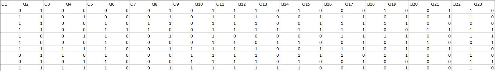
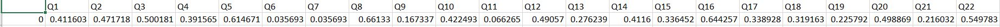

# AI Neural Network CAT
 Competitive adaptive test system designed by using Neural Network

The problem statement was to figure out the weights(the degree of difficulty of the questions). The prescribed output was an autogenerated csv file. 
The given input was as follows:

The dataset consists of responses of 1000 students. Here, 1 indicates "Right answer" and 0 indicates "Wrong answer". Features of this model are the questions, and Y is derived from the average of user responses intially. 

The Dense Neural Network model has been used for this problem. The first part deals with training the dataset with the given train set. We divide the data into batch of 25, so as to solve the shape mismatch problem. 

    data = []

    for j in range(len(df.columns)):

     z = df[df.columns[j]].values
     y = z[-1]
     z = z[:-1]

    for i in range(len(z)//25):.

      data.append([z[25*i:25*i+25],y])

    random.shuffle(data) 

For the test dataset, we choose any 10 columns for testing the model. The following code snippet shows how the model has been tested by the given test dataset.

    df = pd.read_csv('xtest.csv')

    df1 = pd.DataFrame()

    for i in df.columns[:10]:
      pred_questions.append(df[i].iloc[:25])
    pred_questions = np.array(pred_questions)

    pred = model.predict(pred_questions)

    for idx,i in enumerate(df.columns[:10]):
      df1[i] = pred[idx]

    df1.to_csv('predicted_answers2.csv')
    
 The autogenerated csv is as follows: 
 
